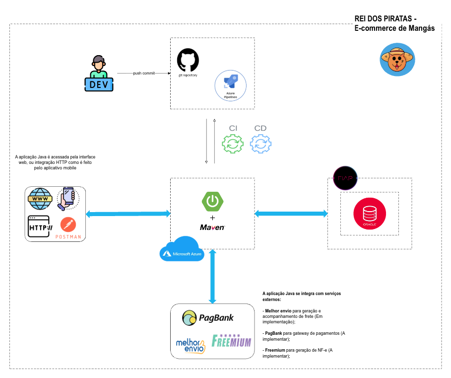

# 🏴‍☠️ Rei dos Piratas – E-commerce de Mangás

  
  
  
  

---

## 📌 Projeto

Este repositório faz parte do **CHALLENGE ORACLE - FIAP** (Turma 2TDSPS-2025).

O projeto **Rei dos Piratas** consiste em desenvolver um **e-commerce de mangás novos e usados**, com possibilidade de expansão futura para outros segmentos.

---

## Diagrama geral da arquitetura da aplicação

---

## Vídeo explicativo da solução

> Acesse o Link abaixo para assistir ao vídeo explicativo da solução.

[Vídeo Explicativo no YouTube](https://www.youtube.com/watch?v=wSOUlz6PsAY)

## 👥 Integrantes do Grupo – CATECH

- **RM561144**: Jonas Oliveira - Responsável por Java e banco de dados
- **RM559336**: Wendell Dourado - Responsável por Mobile e Devops
- **RM559622**: Daniel Batista - Responsável por .NET, IoT e QA

---

## 🎯 Objetivo

Implementar um **projeto escalável, seguro e financeiramente viável**, migrando a operação de uma loja da Shopee para uma infraestrutura própria em nuvem.

---

## 🧭 Método de Trabalho

O desenvolvimento seguirá a metodologia **SCRUM**, permitindo entregas incrementais e evolução contínua da solução.

---

## 💡 Proposta de Valor

- Fortalecer o **relacionamento direto** entre funcionario e cliente.
- Garantir **preços competitivos** de mangás novos e usados.
- Oferecer **busca eficiente** e experiência otimizada de compra.

---

## 👤 Público-Alvo

Leitores e colecionadores de mangás, principalmente **jovens e adultos de classe média e alta** que consomem animes e cultura japonesa.

---

## ⚙️ Etapas de Implantação

- Estudo das documentações de APIs de terceiros.
- Definição de fluxo de negócio e requisitos legais.
- Design de UI/UX responsivo.
- Modelagem do banco de dados.
- Integração entre **Front-End, Mobile e Back-End**.
- Testes, monitoramento e otimizações.

---

## 🧱 Funcionalidades Principais

### Usuário Cliente

- Cadastro e login
- Navegação na loja
- Compra, cancelamento e devolução
- Acompanhamento de entrega

### Funcionário

- Emissão de notas
- Atualização de estoque
- Inserção de produtos
- Criação de promoções

### Administrador

- Todas as funções de funcionário
- Gerenciamento de usuários e permissões

---

## 🔑 Recursos-Chave

### Infraestrutura (Azure)

- Azure Virtual Machines (containers)

### Back-End

- **Java 21** + **Spring Framework** (API REST) para pedidos e clientes
- [Readme da aplicação Java (Back-End)](Java/rei-dos-piratas/README.md)
- [JSON do postman](./Java/rei-dos-piratas/API%20Rei%20dos%20Piratas.postman_collection.json)

- **C# + .NET** para gerenciamento de funcionarios e produtos

### Mobile

- **React Native**

### Banco de Dados

- **Oracle SQL** (PL/SQL quando necessário)

### Integrações

- **Melhor Envio** (frete e transportadoras)
- **PagBank** (gateway de pagamento)

---

## 🧮 Versões das Ferramentas

- **Java 21**
- **Spring Framework 6.x**
- **Next.js 14**
- **React Native 0.74**
- **Oracle SQL 19c**
- **Azure CLI 2.60+**

---

## 🚀 Próximos Passos

- Finalizar protótipos de UI/UX.
- Implementar MVP da API com autenticação.
- Configurar infraestrutura Azure inicial.
- Integrar APIs de terceiros.
- Preparar testes automatizados.

---

## 📚 Referências

- [Azure – Documentação Oficial](https://learn.microsoft.com/pt-br/azure)
- [Spring Framework](https://spring.io/projects/spring-framework)
- [Next.js](https://nextjs.org/docs)
- [React Native](https://reactnative.dev/docs/getting-started)
- [Oracle Database](https://docs.oracle.com/en/database/)
- [PagBank API](https://developer.pagbank.com.br/docs/apis-pagbank)
- [Melhor Envio API](https://docs.melhorenvio.com.br/)
